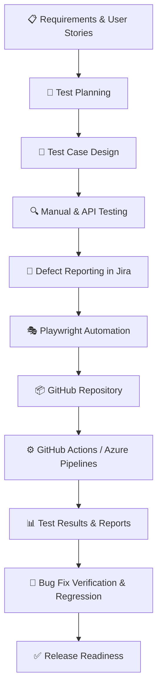

# 👋 Hi, I'm Muhammad Zeeshan Latif

<h3 align="center">Junior Software Quality Engineer | Manual & API Testing | Playwright Automation | AI-Assisted Testing</h3>

  

  
  
  

---

## 👨‍💻 About Me

I'm a **Computer Science graduate** transitioning into Software Quality Engineering, with a background in web development and education and hands-on experience in software testing.

My focus is on delivering reliable software through manual testing, REST API testing, Playwright automation, and AI-assisted QA workflows.

* 🔍 **Manual Testing:** Functional, regression, exploratory, smoke, and integration testing.
* 🚀 **API Testing:** Postman, REST APIs, CRUD operations, OAuth 2.0, and Bearer-token authentication.
* 🎭 **Automation:** Playwright with TypeScript and JavaScript, Page Object Model (POM), and cross-browser testing.
* 🤖 **AI-Assisted QA:** ChatGPT, Claude, GitHub Copilot, Cursor, and Gemini.
* 🔄 **CI/CD:** GitHub Actions, Azure DevOps Pipelines, and automated test execution.
* 🐳 **DevOps:** Docker fundamentals, Git, GitHub, and branching workflows.
* 📋 **Test Management:** Jira, Azure DevOps Test Plans, test cases, and defect tracking.

🎯 **Career Goal:** To contribute as a Junior Software Quality Engineer while continuously developing my automation and software testing skills.

---

## 🛠️ Technical Skills

### 🔍 Manual & Functional Testing

  
  
  
  
  
  

* Test case design and execution
* Bug reporting and defect lifecycle
* Equivalence Partitioning (EP)
* Boundary Value Analysis (BVA)
* Cross-browser and cross-device testing
* SDLC and STLC fundamentals

### 🌐 API Testing

  
  
  
  

* GET, POST, PUT, PATCH, and DELETE
* CRUD operations and response validation
* Status codes and response payloads
* OAuth 2.0 and Bearer tokens
* API collections and regression checks
* Basic SQL and data validation

### 🎭 Test Automation

  
  
  
  

* Playwright test automation
* Page Object Model (POM)
* Locators and assertions
* Cross-browser automation
* Automated login and Salesforce workflows
* Debugging and flaky-test investigation
* Selenium and Cypress — currently learning

### 🤖 AI-Assisted Testing

  
  
  
  
  

* AI-assisted test case and test scenario generation
* Test script drafting and debugging
* Defect analysis and documentation
* Exploratory testing support
* Independent review and validation of AI-generated results

### 🔄 CI/CD, DevOps & Collaboration

  
  
  
  
  
  
  

* Automated test execution with CI/CD
* Git branching, commits, merging, and pull requests
* Azure Pipelines and Azure Test Plans
* Jira issue and user-story tracking
* Dockerfiles, containers, and Docker Compose fundamentals

---

## 💼 Professional Experience

### 🔍 SQA Intern — Ahmad Institute

**August 2026 – October 2026**

* Designed and executed functional, regression, and exploratory test cases for web applications.
* Performed REST API testing using Postman, including CRUD workflows, authentication, and response validation.
* Developed Playwright automation scripts using TypeScript, locators, assertions, and Page Object Model.
* Automated Salesforce login and Opportunity creation workflows.
* Used AI tools to assist with test case generation, debugging, and QA documentation, validating the results independently.
* Practiced CI/CD workflows using GitHub Actions and Azure DevOps.
* Worked with Jira, Git, and Azure DevOps Test Plans for test management and traceability.

### 💻 Junior Web Developer — Craft Bent Solution

**November 2023 – May 2024 | Lahore, Pakistan**

* Developed and maintained responsive websites using WordPress, Squarespace, and HubSpot CMS.
* Customized websites using HTML, CSS, and JavaScript.
* Fixed functionality and UI issues and improved website responsiveness and cross-browser compatibility.

### 🌐 Web Developer Intern — MetaFourt

**June 2024 – August 2024 | Remote**

* Developed and maintained front-end interfaces using HTML, CSS, JavaScript, and React.js.
* Supported feature development, debugging, and performance improvements.
* Participated in code reviews and collaborative development.

### ⚙️ MERN Stack Trainee — TechLift Lahore

**November 2023 – May 2024**

* Developed MERN applications and RESTful APIs with CRUD and authentication functionality.
* Built a responsive e-commerce project and gained practical experience with application workflows and backend behavior.

### 📚 Computer Science Teacher

**The Education Science Academy / United Charter School | September 2024 – March 2026**

* Taught Computer Science to Grades 9–12.
* Prepared lesson plans and explained programming fundamentals and digital literacy.
* Troubleshot computer hardware and software issues and supported computer-lab operations.

---

## 🚀 Featured QA Projects

### 🛒 1. E-Commerce Web Application Testing Suite

**August 2026 – September 2026**

A practical testing project focused on validating e-commerce functionality and application quality.

* Designed and executed 85+ functional, regression, and exploratory test cases.
* Tested login, cart, checkout, and payment workflows.
* Conducted cross-browser testing on Chrome, Firefox, and Edge.
* Documented 27 defects, including 8 high-severity issues, with reproduction steps and screenshots.
* Tested 12 REST API endpoints using Postman.
* Prepared test plans, defect reports, and release-readiness documentation.
* Used AI-assisted test generation and independently validated test scenarios.

### 🔗 2. REST API Testing Framework — Public Bookstore API

**August 2026 – September 2026**

A Postman-based API testing project covering CRUD operations and response validation.

* Created a Postman collection containing 45+ API requests.
* Tested CRUD operations, authentication, and error-handling scenarios.
* Automated basic regression checks.
* Documented 15 defects with expected and actual results.
* Used basic SQL queries to validate backend data consistency.
* Applied AI-assisted test scenario generation and manually reviewed the results.

### 🔐 3. Salesforce API Integration & Automation

* Integrated Salesforce with Postman using OAuth 2.0.
* Generated access tokens and performed authenticated API requests.
* Tested CRUD operations and validated API responses.
* Automated Salesforce login and Opportunity creation using Playwright.

### 🎭 4. Playwright Login Automation

* Created automated login tests using Playwright.
* Used TypeScript, locators, assertions, and Page Object Model.
* Practiced cross-browser testing and debugging.
* Worked with GitHub and Azure DevOps to integrate automated tests into CI/CD workflows.

### 🐳 5. Dockerized REST API

* Practiced creating Dockerfiles and Docker Compose configurations.
* Built and ran containerized Node.js applications.
* Explored Nodemon-based development workflows and automatic container restarts.

---

## 🌐 Previous Web Development Projects

| Project                         | Technologies           | Website                                                       |
| ------------------------------- | ---------------------- | ------------------------------------------------------------- |
| Minato Cars                     | WordPress, HTML, CSS   | [Visit Website](https://www.minatocars.org/)                  |
| Built Off Faith Sports Recovery | Squarespace, HTML, CSS | [Visit Website](https://www.builtofffaithsportsrecovery.com/) |
| Noor Son's Lubricants           | WordPress, HTML, CSS   | [Visit Website](https://noorsons.pk/)                         |

---

## 🧪 Software Testing Knowledge

| Testing Area          | Knowledge & Practice                                 |
| --------------------- | ---------------------------------------------------- |
| Functional Testing    | Validating features against requirements             |
| Regression Testing    | Verifying existing functionality after changes       |
| Exploratory Testing   | Investigating application behavior                   |
| Smoke Testing         | Checking critical functionality                      |
| Integration Testing   | Validating interactions between components           |
| API Testing           | REST endpoints, CRUD, authentication, responses      |
| Cross-browser Testing | Chrome, Firefox, and Edge                            |
| Mobile Testing        | Functional and compatibility testing fundamentals    |
| Security Testing      | Basic security testing concepts                      |
| Test Design           | Equivalence Partitioning and Boundary Value Analysis |
| Automation            | Playwright, TypeScript, JavaScript, and POM          |

---

## 🔄 QA Automation Workflow

---

## 🎓 Education & Certifications

* 🎓 **BS Computer Science** — University of Agriculture Faisalabad (2020)
* 🧪 **Postman API Testing Course** — Completed
* ⚙️ **MERN Stack Bootcamp** — TechLift Lahore (2024)
* 🌐 **Website Development** — e-Rozgaar Program (2022)

**Current learning:** Playwright, Azure DevOps Test Plans, GitHub Actions, Docker fundamentals, and AI-assisted testing workflows.

---

## 📊 GitHub Statistics

  
  

  

  

---

## 🤝 Connect With Me

  
  
  

  💼 Open to Junior SQA Engineer, Junior QA Engineer, Manual QA, and QA Automation opportunities.

  <b>Quality is not just about finding bugs; it's about building confidence in software.</b>

